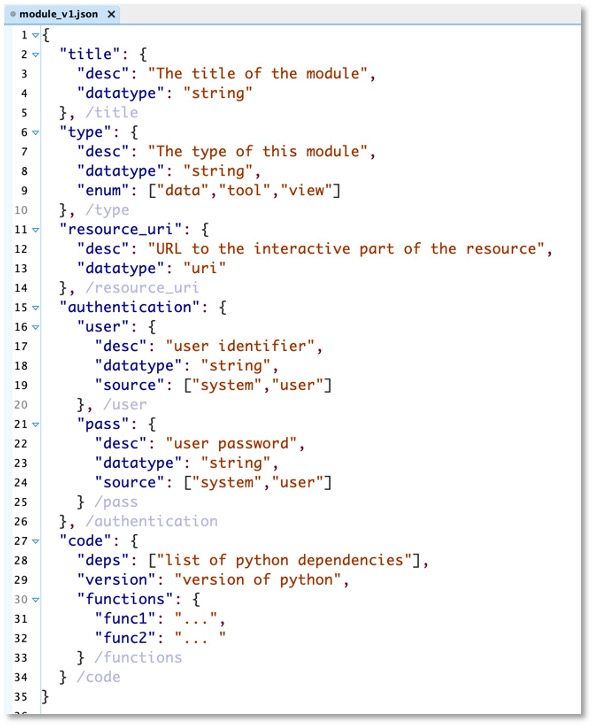
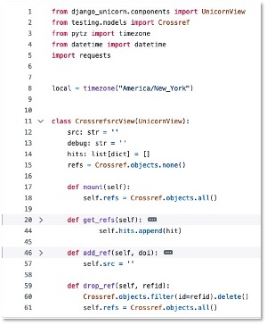

# KnowMo
**KnowLedger** ecosystem repository for UI **module** development

The focus of this repository is the definition of a specification for modules, utilized in the KnowLedger Research Data 
Management (RDM) System.  Modules are generic containers for external resources (data repositories, services, tools, or 
any other resource useful for research) that researchers can integrate into their instance of KnowLedger.

The development team (request to join the team [here](https://github.com/KnowLedgerProject/KnowMo/issues/new?template=request-to-join.md))
is focused on defining the structure of the metadata for the definition of a module created for KnowLedger.  This is an
iterative process, and we plan to have multiple versions of the specification as other features and the core KnowLedger 
software evolve.

The general development stages are expected to be as follows:

1. core definition elements to define a module
2. module type specific metadata
3. instance metadata fields
4. event metadata needs (in the KnowLedger software)
5. semantic annotation definition
6. authentication layer metadata

A schema for the metadata development will be created in the JSON schema language.  Subsequently, a JSON-LD context file
will be developed to add the semantic annotation of module metadata fields.

Once the specification is developed enough, documentation will be developed on how to create instance JSON-LD to define 
instances of modules.  This will be used to gather use case issues/needs and eventually developed a set of unit tests 
for modules.  Once the specification is available, community members can fork this repository and create JSON-LD files
that describe modules they want to use in the KnowLedger interface.  These can then be submitted for inclusion in this
repository by submitting a pull request which will be reviewed by admin on this repo.  Finally, accepted module files 
will be available to users of KnowLedger from within the system configuration.

## Example
A simple example of this is below.  Researchers need to get access to the literature and accessing metadata from the
Crossref API is one programmatic way to do this.  A module to provide this functionality could be implemented as shown below.

From left to right:  Left: A generic metadata specification (in JSON) for a module is developed and then an instance 
(also JSON) of the schema (not shown) is created for a Crossref search tool.  Middle: The Crossref module is enabled 
for a researcher using KnowLedger and the JSON specification file is used to create the code and UI to display the 
module.  Right: The module appears in the UI and researcher uses it to add find and import papers to the reference 
manager.

|                      Metadata Spec                      |                       Module Code                       |                      UI Component                      |
|:-------------------------------------------------------:|:-------------------------------------------------------:|:------------------------------------------------------:|
|  |  | <video src='images/knowmo_mod_example.jpg' width=200/> |
